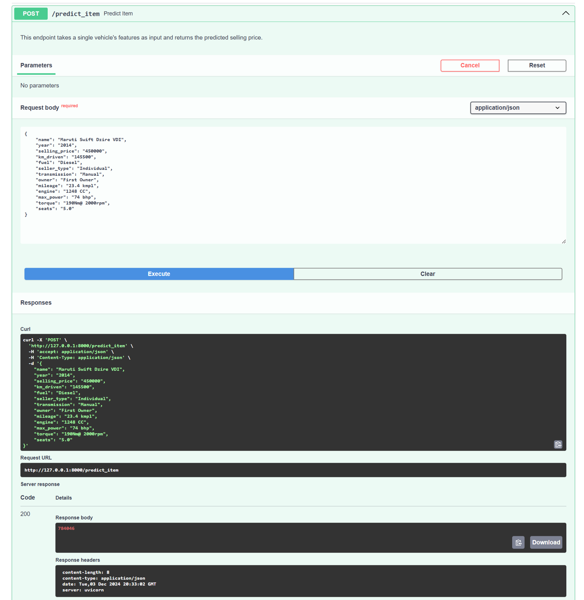
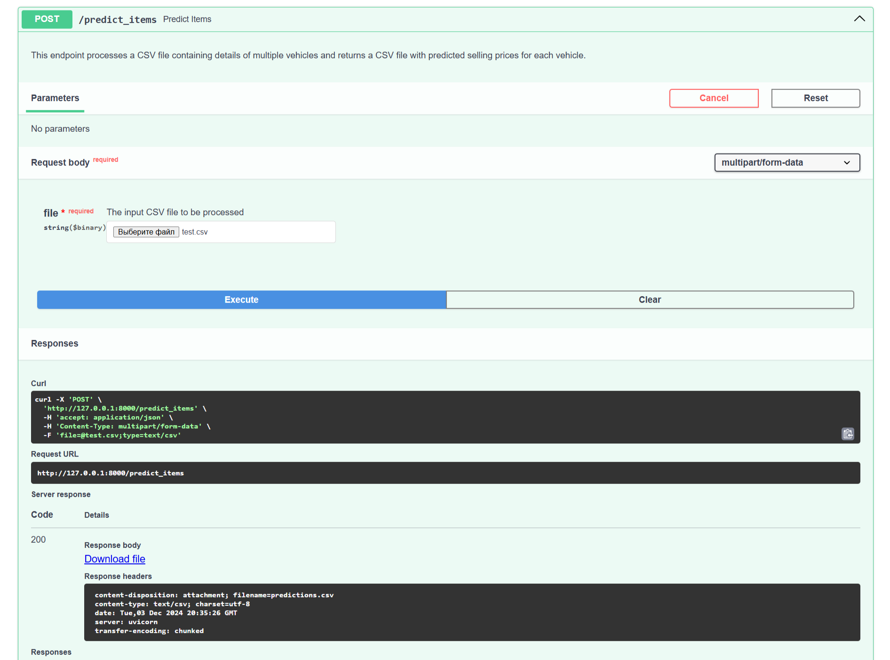

# Vehicle Price Prediction API

## 📖 О проекте

В ходе выполнения заданий мы ознакомились со способами предобработки входных данных и 4 моделями регрессии, каждая из которых показала различный результат в задаче предсказания стоимости автомобиля. Этот проект является примером применения машинного обучения в реальных задачах, где результаты моделей интегрируются в веб-приложения для удобства использования.

## 🔍 Анализ моделей

В рамках проекта были изучены следующие модели регрессии, результаты которых представлены в таблице:

| **Модель**        | **Оценка R²** |
|--------------------|---------------|
| **Linear**        | 0.624         |
| **Lasso**         | 0.623         |
| **ElasticNet**    | 0.607         |
| **Ridge**         | 0.608         |

Были выполнены следующие этапы предобработки данных:
- **Кодирование категориальных признаков**: использование методов One-Hot Encoding для представления категориальных данных.
- **Масштабирование числовых признаков**: применение стандартизации (с использованием `StandardScaler`) для улучшения качества предсказаний.

Согласно предложенной бизнес-метрике, модель **Ridge Regression** показала лучший результат с метрикой **0.247**, поэтому именно для этой модели был реализован Web API.

## 🚀 Реализация Web API

Для создания API использовалась библиотека **FastAPI** — мощный инструмент для построения современных веб-сервисов. Были реализованы 2 конечные точки:

### 1. **`POST /predict_item`**
Эта конечная точка позволяет предсказать стоимость одного автомобиля на основе его характеристик.

### 2. **`POST /predict_items`**
Эта конечная точка позволяет обработать CSV-файл с характеристиками нескольких автомобилей и вернуть файл с добавленной колонкой selling_price, содержащей предсказанные значения цены.

